# Smart Retail & Customer Intelligence Platform

Welcome to the Smart Retail & Customer Intelligence Platform. This is a comprehensive, AI-powered ecosystem designed for modern retail environments. It provides store managers and retail analysts with real-time insights into customer sentiment, foot traffic, facial biometrics for secure login, and an intelligent chatbot for data queries.

## Architecture & Technology Stack

* **Frontend:** React, Vite, TypeScript, TailwindCSS v4, Lucide React (Icons), React Router, Framer Motion (Animations).
* **Backend:** FastAPI, Python, SQLAlchemy, Uvicorn, SQLite.
* **Authentication:** JWT (JSON Web Tokens) with secure password hashing (bcrypt).

## Core AI Models & Methodologies

### 1. Sentiment Analysis Engine
The platform includes a custom-trained machine learning model to analyze customer feedback and determine sentiment, emotional context, and key topics.
* **Algorithm:** Multinomial Naive Bayes classification with TF-IDF (Term Frequency-Inverse Document Frequency) vectorization.
* **Dataset:** Trained on the HuggingFace `cardiffnlp/tweet_eval` sentiment dataset, heavily augmented with a specialized, synthetic retail dataset to capture domain-specific nuances (e.g., return policies, product quality, sizing issues).
* **Features:** Maps textual sentiment to specific emotions (Joy, Satisfaction, Anger, Disappointment) based on prediction confidence, and extracts core keywords while filtering out English stop words.

### 2. Facial Biometrics (FaceOnboarding & Login)
* **Framework:** DeepFace.
* **Methodology:** The system uses a state-of-the-art Convolutional Neural Network (CNN) architecture (defaulting to VGG-Face or Facenet based on DeepFace internals) to map uploaded face images into high-dimensional embeddings. It securely compares the embeddings of login attempts with the stored profile picture of users in real time.

### 3. Intelligent Chatbot Assistant
* **Primary AI:** Google Gemini (Gemini 1.5 Flash).
* **Fallback AI:** Groq inference engine running Llama 3 (8B).
* **Methodology:** The chatbot acts as an expert retail assistant. It maintains conversational memory and context history through the backend. If the primary Gemini model encounters API rate limits or quota issues, the backend intelligently and seamlessly fails over to the Groq Llama 3 model, ensuring zero downtime for end-users.

## Database Schema

The platform relies on a lightweight, file-based SQLite database (`smart_retail.db`) orchestrated through SQLAlchemy. 

**User Model (`users` table):**
* `id`: Integer, Primary Key
* `email`: String, Unique, Indexed
* `hashed_password`: String
* `full_name`: String
* `role`: String (e.g., "user", "admin")
* `profile_picture_path`: String (Path to stored biometric login image)
* `age`: Integer (Optional)
* `country`: String (Optional)
* `pin_code`: String (Optional)
* `joined_date`: DateTime

## How to Run Locally

To get the platform up and running on your local machine, you will need two separate terminal windows—one for the FastAPI backend and one for the React frontend.

### Prerequisites
* Python 3.9+
* Node.js 18+

### 1. Backend Setup

Open a terminal and navigate to the project root, then proceed into the backend directory:
```bash
cd backend
```

Create and activate a Python virtual environment:
```bash
# On Windows:
python -m venv venv
.\venv\Scripts\activate

# On Mac/Linux:
python3 -m venv venv
source venv/bin/activate
```

Install the required Python dependencies:
```bash
pip install -r requirements.txt
```

Set up your environment variables. Open the `backend/.env` file (or create one if it doesn't exist) and add your API keys for the chatbot functionality:
```env
GEMINI_API_KEY=your_gemini_api_key_here
GROQ_API_KEY=your_groq_api_key_here
```

Start the FastAPI server:
```bash
uvicorn app.main:app --host 0.0.0.0 --port 8000
```
The backend is now running at `http://localhost:8000`.

### 2. Frontend Setup

Open a new terminal window, navigate to the project root, then proceed into the frontend directory:
```bash
cd frontend
```

Install the required Node dependencies:
```bash
npm install
```

Start the Vite development server:
```bash
npm run dev
```
The frontend is now accessible in your browser at `http://localhost:5173`.

## Screenshots

### Authentication & Dashboard
<div align="center">
  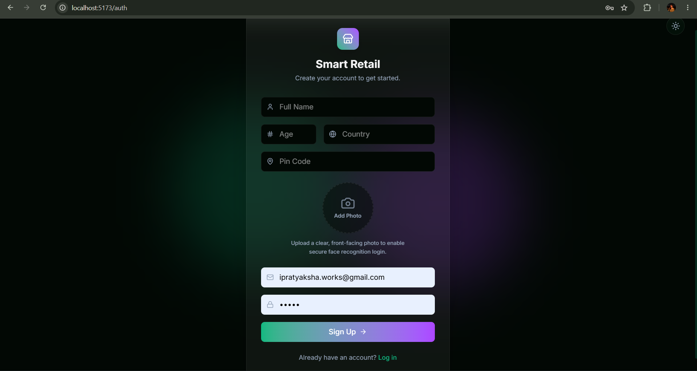
  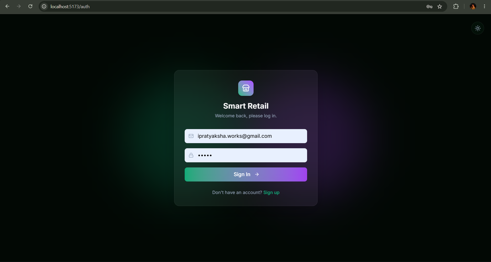
</div>
<br/>
<div align="center">
  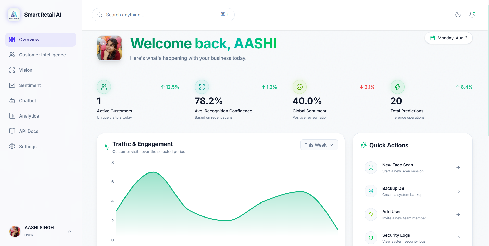
  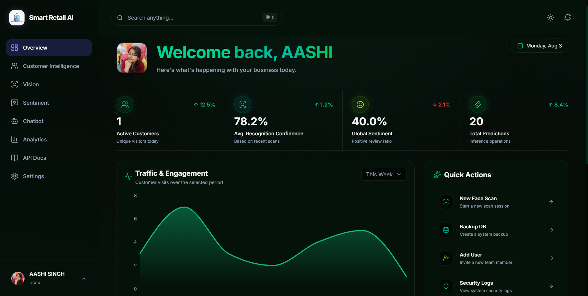
</div>

### Analytics & Customer Intelligence
<div align="center">
  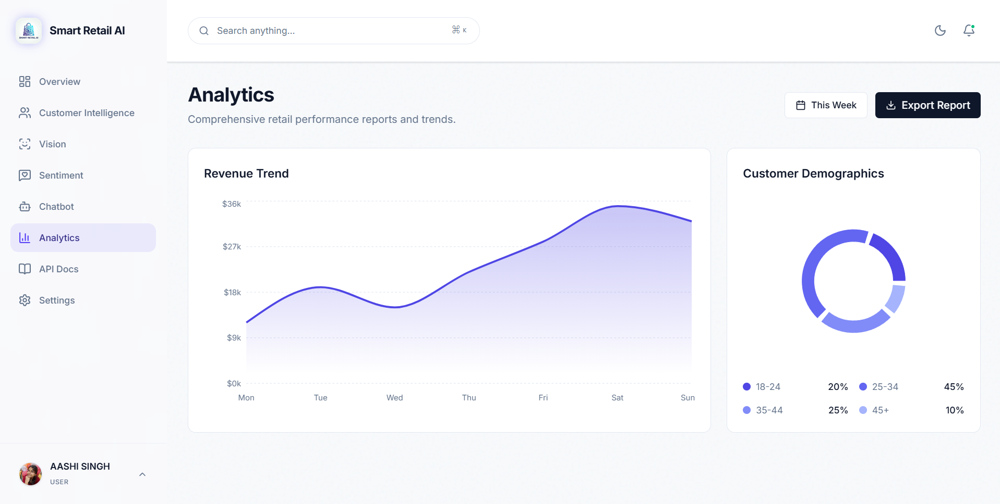
  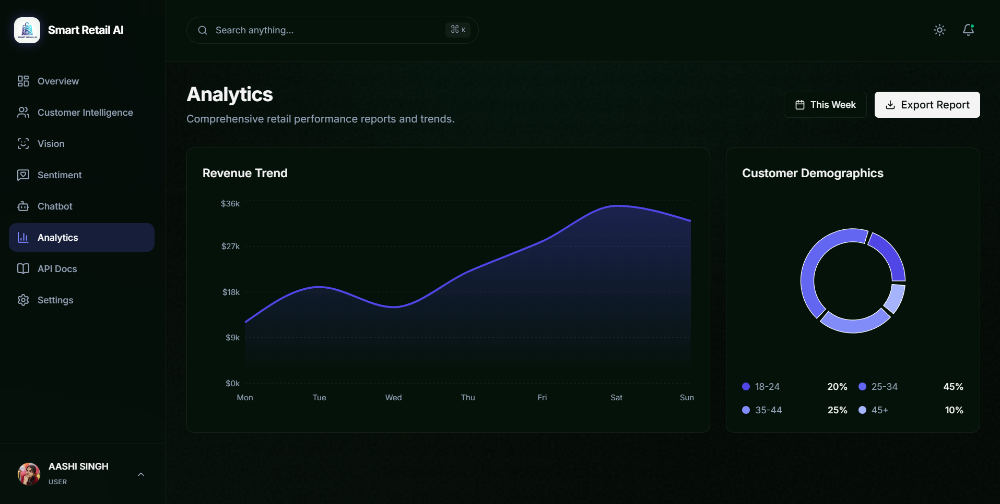
</div>
<br/>
<div align="center">
  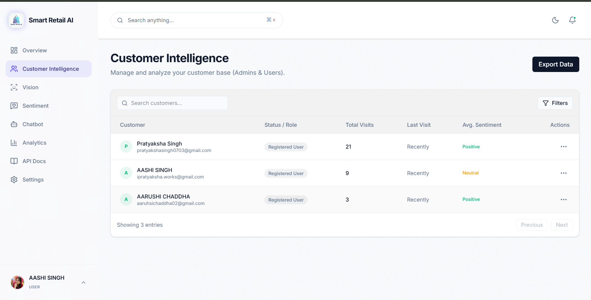
  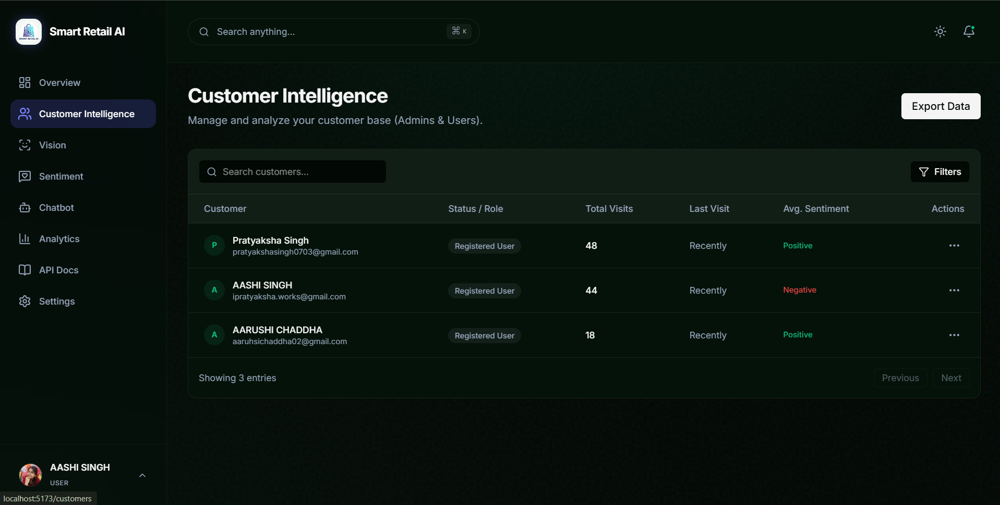
</div>

### AI Capabilities (Chatbot & Vision)
<div align="center">
  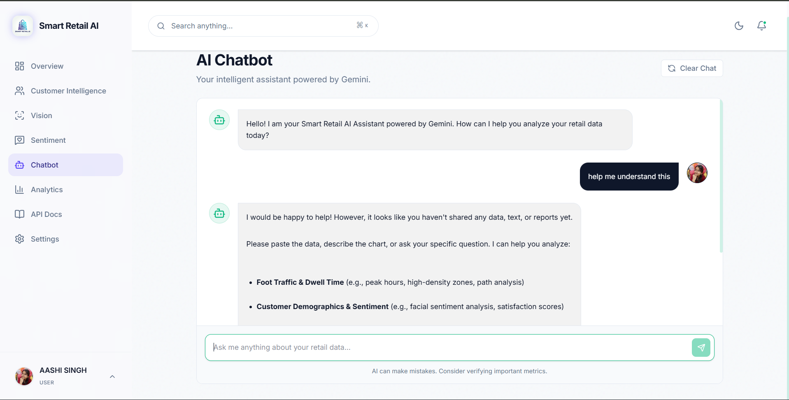
  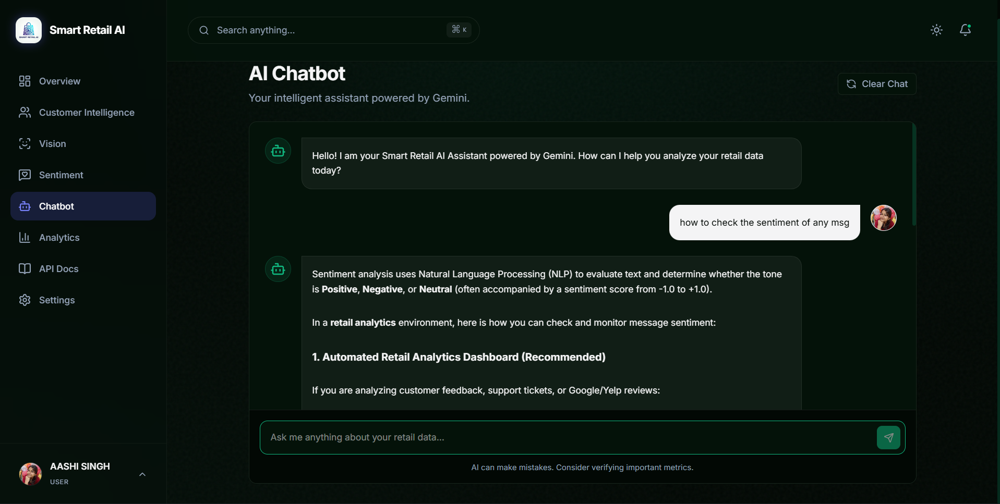
</div>
<br/>
<div align="center">
  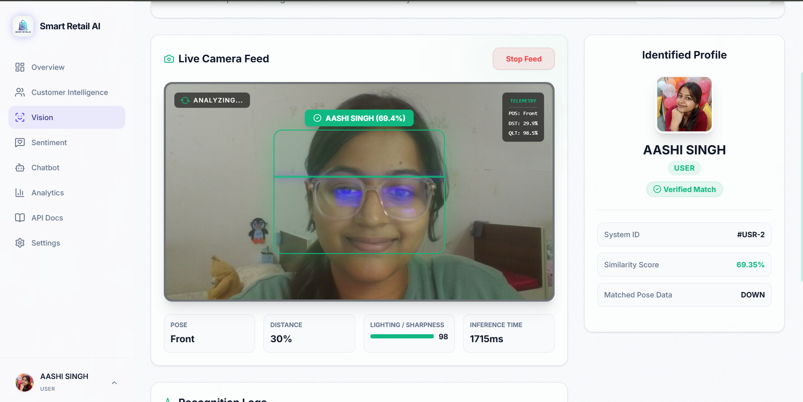
  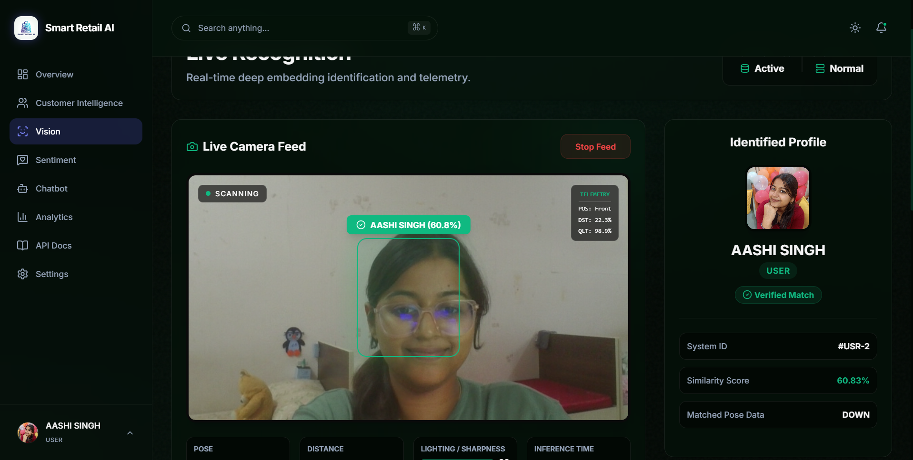
</div>

### Sentiment Analysis & Settings
<div align="center">
  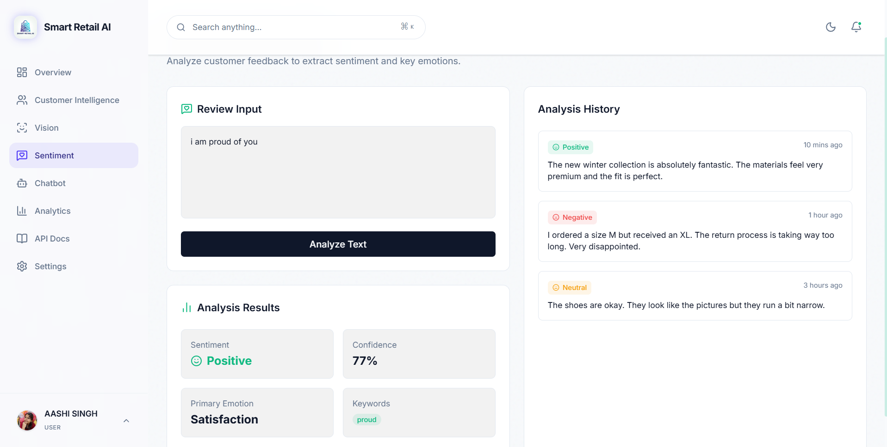
  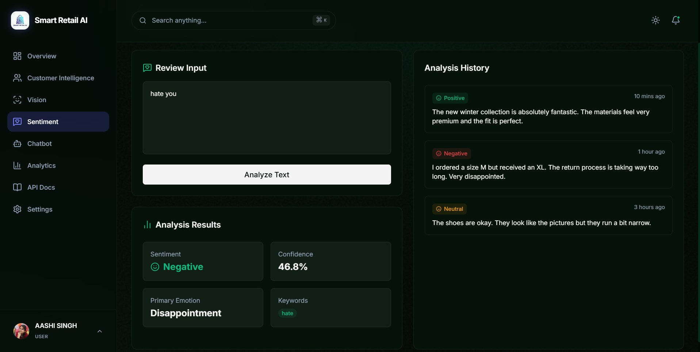
</div>
<br/>
<div align="center">
  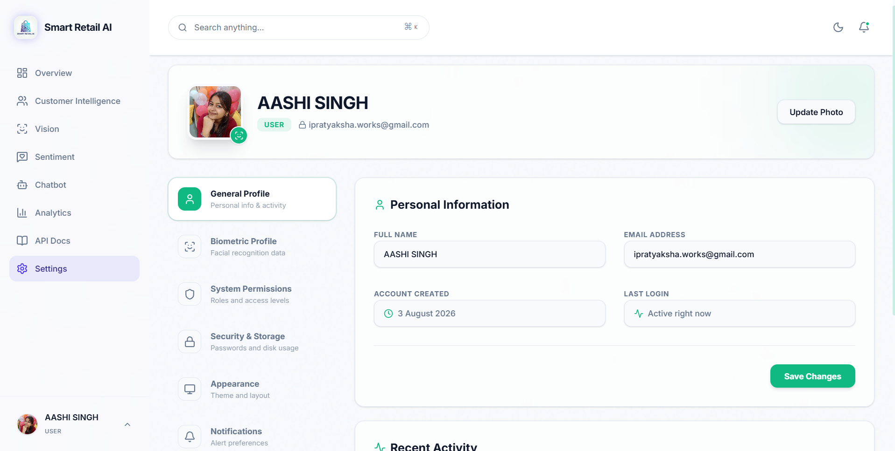
  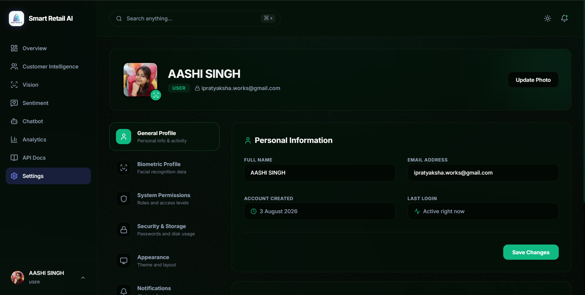
</div>

## Additional Information
* **Biometric Login:** When creating an account on the `/auth` page, you will be prompted to upload a profile picture. Ensure the image clearly displays your face, as this will be used for biometric verification upon your next login.
* **Environment Configuration:** The system automatically checks for the user's system-level dark/light mode preference and defaults to it, with manual override buttons provided throughout the platform.
